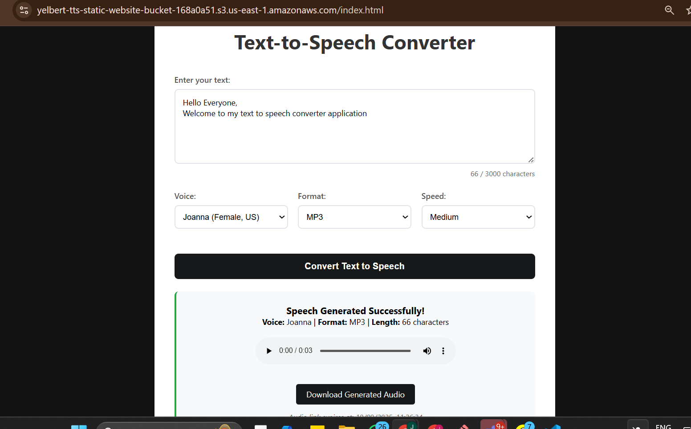
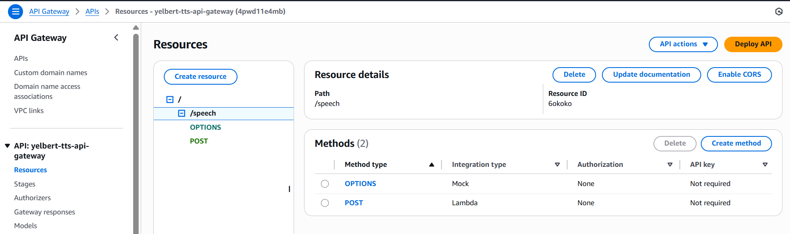
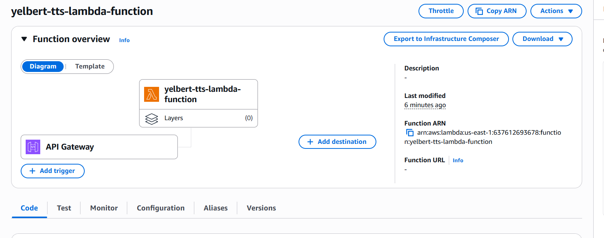
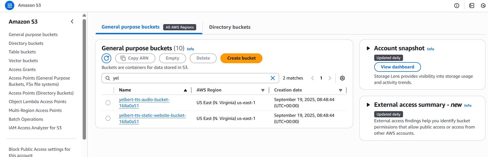

# Text-to-Speech API (AWS + Terraform)
## Intro
This project deploys a serverless **Text-to-Speech (TTS)** system on AWS using:
- **Amazon Polly** (speech synthesis)
- **AWS Lambda** (backend compute)
- **Amazon API Gateway** (REST API with CORS support)
- **Amazon S3** (audio file storage + static frontend hosting)
- **Terraform** (infrastructure as code)

---

## 🚀 Architecture

1. Client (e.g., web frontend) sends text to the API Gateway endpoint (`POST /speech`).
2. API Gateway invokes the **Lambda function**.
3. Lambda calls **Amazon Polly** to generate an MP3 file.
4. Lambda stores the MP3 in **S3** and returns a **signed URL** for download.
5. Frontend fetches and plays the generated speech.

---

## 📂 Project Structure
```
-backend
 ├── provider.tf
 ├── api.tf
 ├── lambda.tf
 ├── s3.tf 
 ├── iam.tf 
 ├── variables.tf 
 ├── lambda_function.py
 ├── lambda.zip 
-frontend
 └── index.html
 ```

 
---

## ⚙️ Setup Instructions

### 1. Prerequisites
- [Terraform](https://developer.hashicorp.com/terraform/downloads) installed
- AWS CLI installed and configured (`aws configure`)
- AWS account with permissions for S3, Lambda, API Gateway, IAM, Polly

---

### 2. Deploy Infrastructure
Initialize Terraform:
```
terraform init
```
Check Template Formatting:
terraform fmt

Validate configuration:
```
terraform validate
```

Preview Deployment:
```
terraform plan
```
Deploy resources:
```
terraform apply
```
### 3. Deploy Lambda Code

Package the function:
```
zip lambda.zip lambda_function.py
```

### 4. Upload Frontend (optional)

If you have a static site (index.html), upload it to your S3 bucket:
```
aws s3 cp index.html s3://<your-bucket-name>/index.html
```

## 🔑 API Usage
Endpoint:
```
POST https://<api-id>.execute-api.<region>.amazonaws.com/prod/speech
```
## 🖼️ Screenshots





## 🛠️ Troubleshooting

1. CORS errors: Ensure OPTIONS method + Lambda response headers allow Access-Control-Allow-Origin: *.

2. 502 Bad Gateway: Check CloudWatch logs for Lambda errors.

3. 403 Preflight: Confirm CORS configuration in API Gateway and headers in Lambda response.

4. Public frontend access: Add an S3 bucket policy

## 📌 Next Steps / Improvements

1. Add CloudFront for caching and HTTPS.

2. Extend API to support multiple voices/languages.

## 📝 License

MIT License:

```
MIT License – feel free to use this project as you like.
```

